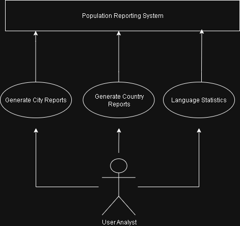

# Use Case Specification – Population Reporting System

## UC01 – Generate Country Reports
**Description:**  
Allows users to generate reports of all countries, sorted by population or filtered by continent or region.

**Primary Actor:**  
System User / Analyst

**Preconditions:**  
- The database connection is active.  
- Country data exists in the SQL database.

**Main Flow:**
1. User selects the "Country Report" option.
2. System retrieves all countries from the database.
3. User may choose to filter by continent or region.
4. System sorts results from highest to lowest population.
5. Report is displayed or exported.

**Postconditions:**  
- A country report is generated successfully.

**Exceptions:**  
- Database not reachable.  
- No data found.

**Related GitHub Issues:**  
#1 – Fetch all countries  
#2 – Filter countries by continent  
#3 – Filter countries by region  
#4 – Sort by population  
#5 – Display formatted output

---

## UC02 – Generate City Reports
**Description:**  
Enables users to view or export city population reports for the world, continent, region, country, or district.

**Primary Actor:**  
System User

**Preconditions:**  
- City data exists in the database.

**Main Flow:**
1. User selects "City Report".  
2. User chooses world, continent, region, or country.  
3. System retrieves relevant cities and their populations.  
4. System sorts cities by population (largest to smallest).  
5. Results are displayed.

**Postconditions:**  
- City report successfully generated.

**Exceptions:**  
- Invalid region or missing data.

**Related GitHub Issues:**  
#6 – Fetch all cities  
#7 – Filter cities by country  
#8 – Sort cities by population  
#9 – Handle missing data  
#10 – Add display format

---

## UC03 – Generate Capital City Reports
**Description:**  
Displays all capital cities, filtered by world, continent, or region, sorted by population.

**Primary Actor:**  
System User

**Preconditions:**  
- Capital cities data is available.

**Main Flow:**
1. User selects "Capital City Report".  
2. System fetches capital cities and associated populations.  
3. User can filter by continent or region.  
4. System displays results in descending population order.

**Postconditions:**  
- Capital city report generated.

**Exceptions:**  
- Missing capital city information.

**Related GitHub Issues:**  
#11 – Fetch capital cities  
#12 – Filter by continent  
#13 – Filter by region  
#14 – Sort by population  
#15 – Display report

---

## UC04 – Population Breakdown Reports
**Description:**  
Calculates and displays total populations, including people living in and outside of cities, for continents, regions, and countries.

**Primary Actor:**  
System User / Analyst

**Preconditions:**  
- City and country data are available.

**Main Flow:**
1. User selects "Population Breakdown".  
2. System calculates total, city, and non-city populations.  
3. System computes percentages.  
4. Results are displayed or exported.

**Postconditions:**  
- Breakdown report successfully generated.

**Exceptions:**  
- Division by zero or missing population values.

**Related GitHub Issues:**  
#16 – Calculate total population  
#17 – Calculate city population  
#18 – Calculate rural population  
#19 – Compute percentages  
#20 – Format output for display/export

---

## UC05 – Language Statistics
**Description:**  
Displays the number and percentage of people who speak specific languages (Chinese, English, Hindi, Spanish, Arabic).

**Primary Actor:**  
System User

**Preconditions:**  
- Population and language data available in the database.

**Main Flow:**
1. User selects "Language Statistics".  
2. System calculates total speakers for each target language.  
3. System computes the percentage of world population.  
4. System displays results in descending order.

**Postconditions:**  
- Language statistics generated.

**Exceptions:**  
- Missing or inconsistent data.

**Related GitHub Issues:**  
#21 – Retrieve language data  
#22 – Calculate world totals  
#23 – Compute percentages  
#24 – Sort and display  
#25 – Handle missing values

